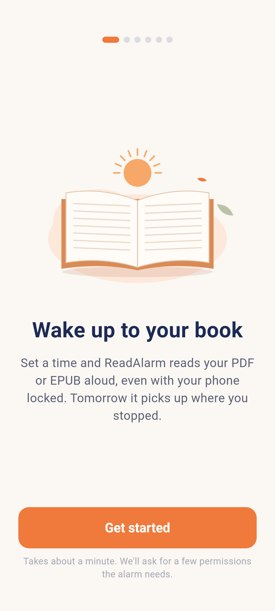
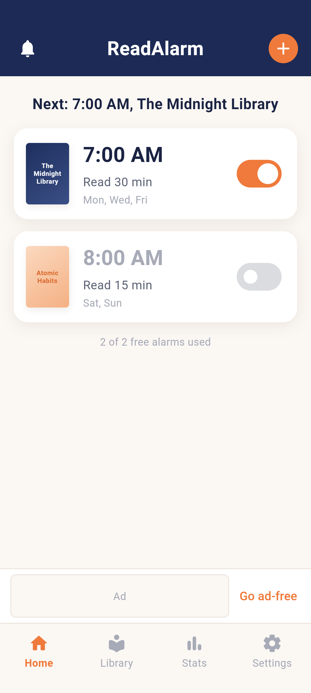
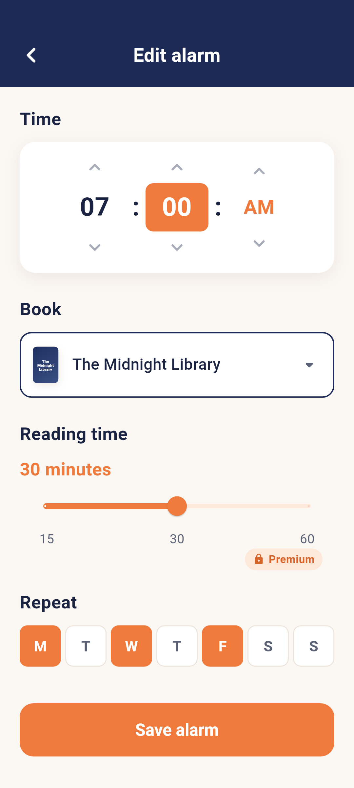
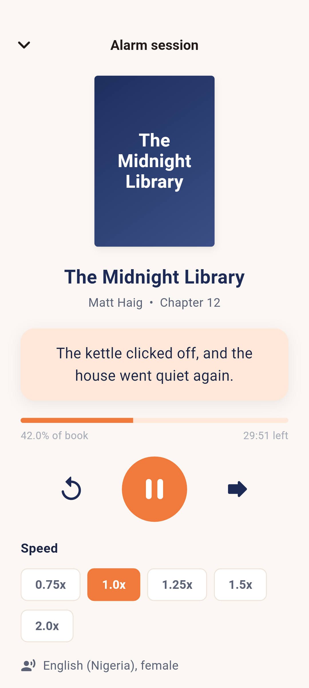

# flutterreadalarm
Repo for the ReadAlarm Mobile App

## What works

- **Library:** import PDF and EPUB files (up to 100 MB) with the system file
  picker. Text, title, author and chapters are extracted on the device.
  Scanned PDFs, password-protected PDFs and DRM EPUBs are rejected with an
  explanation.
- **Reading aloud:** the phone's text-to-speech engine reads sentence by
  sentence, with pause/resume, skip, speed, and (Premium) voice and pitch.
  A foreground service keeps reading with the screen locked and puts
  Pause/Stop on the lock screen. Your place is saved as you go.
- **Alarms:** exact alarms per weekday or one-off. They ring over the lock
  screen, keep ringing until answered, survive reboots, and offer Start
  reading or Snooze 10 min. Alarm sessions stop after 15/30/60 minutes.
- **Onboarding and Settings → Alarm health:** real Android permission
  requests (notifications, exact alarms/full-screen alarms, battery
  optimisation) and a guide for your phone brand's auto-start setting.
- **Stats:** minutes read per day, weekly total and streak from your
  sessions. Everything is saved on the device.

**Simulated for now:** billing (the paywall's purchase just unlocks Premium
locally) and ads (the banner is a placeholder; the rewarded ad unlocks
60-minute sessions without showing one).

## Development

```sh
flutter pub get
flutter analyze
flutter test test            # unit + widget tests
flutter build apk --release  # APKs land in build/app/outputs/flutter-apk/
```

## Continuous integration

`.github/workflows/flutter-ci.yml` runs on every push to `main` or `claude/**`,
on pull requests, and on demand (**Actions → Flutter CI → Run workflow**):

| Job | What it does |
| --- | --- |
| Analyze & test | `dart format` check, `flutter analyze`, `flutter test test` |
| Build APK | Release APKs (per-ABI and universal), uploaded as the `readalarm-apks-<sha>` artifact |
| Regenerate screenshots | Runs `screenshot_test` and uploads the PNGs as `readalarm-screenshots-<sha>` |

Download the APKs from the run's **Artifacts** section. Release builds are
signed with the debug key until a release keystore is configured in
`android/app/build.gradle.kts`.

## Screenshots

`screenshots/` holds a PNG of every screen (1080×2400). They are produced by
driving the real app through each flow in `screenshot_test/`:

```sh
flutter test screenshot_test
```

| | | | |
| --- | --- | --- | --- |
|  |  |  |  |
